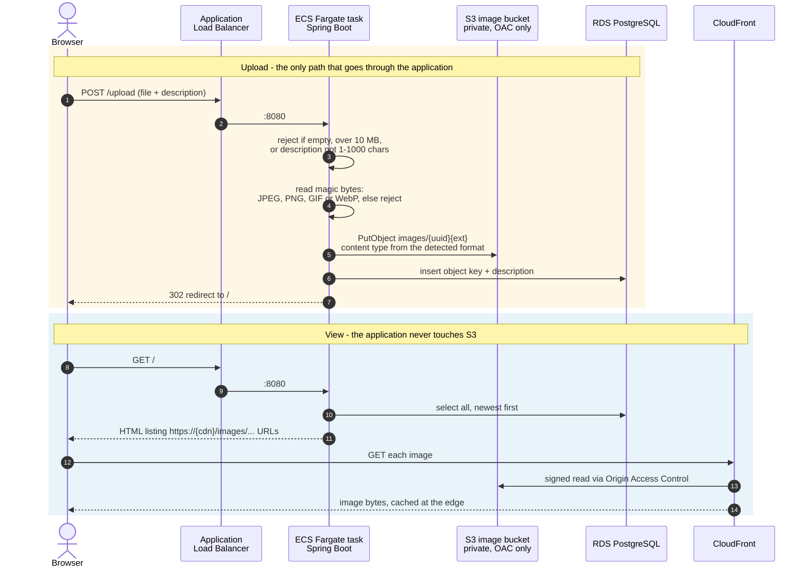

# photo-uploader-app

A small photo gallery: upload an image with a description, see everything
uploaded so far. Images go to a private S3 bucket and are served through
CloudFront; the descriptions live in RDS PostgreSQL. It runs as a container on
ECS Fargate.

Infrastructure lives in a separate repository,
[photo-uploader-infrastructure](https://github.com/leandreAlly/photo-uploader-infrastructure),
which also carries the [architecture diagram](https://github.com/leandreAlly/photo-uploader-infrastructure#readme).

## Stack

Java 21, Spring Boot 3.5, Thymeleaf for the single page, Spring Data JPA,
AWS SDK v2 for S3. Built with Maven, packaged into a multi-stage container
image that runs as a non-root user.

## Endpoints

| Method | Path | Purpose |
| --- | --- | --- |
| `GET` | `/` | Gallery page: upload form plus every photo, newest first |
| `POST` | `/upload` | Accepts `file` and `description`, stores the object, saves the row |
| `GET` | `/health` | ALB health check target - cheap, never touches S3 |
| `GET` | `/api/version` | Build metadata: version, commit, build time |

## How a request flows

The two paths are deliberately asymmetric. Uploads pass through the
application; reads do not. Image bytes are never served by the container - the
gallery page only carries CloudFront URLs, and the browser fetches the pictures
itself.



Two consequences worth knowing:

- **The container never streams image bytes back.** Adding photos does not add
  egress or CPU load to the tasks, so the service scales on upload traffic
  rather than on how many people are browsing.
- **The bucket is unreachable directly.** All public access is blocked and the
  policy names the distribution, so an object URL returns `200` through
  CloudFront and `403` straight from S3.

### Upload validation

An upload has to clear four gates before anything is written:

| Gate | Rule |
| --- | --- |
| Not empty | `file.isEmpty()` is rejected up front |
| Size | 1 byte to 10 MB, enforced in the service and by the multipart limit |
| Description | Trimmed, 1 to 1000 characters |
| Real image | Leading bytes must match JPEG, PNG, GIF or WebP |

The stored extension and `Content-Type` come from the **detected** format, not
from the filename the browser supplied, so a `.jpg` that is really something
else is rejected rather than stored and served back with a misleading type.
Objects are written with `Content-Disposition: inline`.

## Configuration

Everything comes from the environment, nothing about the account is committed.

| Variable | Purpose |
| --- | --- |
| `APP_IMAGE_BUCKET` | Bucket uploads are written to |
| `APP_IMAGE_PREFIX` | Key prefix, default `images/` |
| `APP_CDN_DOMAIN` | CloudFront domain the gallery builds URLs from |
| `SPRING_DATASOURCE_URL` | JDBC URL for the database |
| `SPRING_DATASOURCE_USERNAME` | Injected from Secrets Manager by the task definition |
| `SPRING_DATASOURCE_PASSWORD` | Injected from Secrets Manager by the task definition |
| `APP_VERSION`, `APP_COMMIT`, `APP_BUILT_AT` | Build metadata, set as image build args |

S3 credentials are not configured anywhere: the SDK picks up the ECS task role.
Traffic to S3 leaves through the VPC gateway endpoint because the task subnets
have no route to the internet.

## Running locally

Tests need neither a database nor AWS credentials - the suite slices the web
layer and mocks the repository and storage service.

```bash
mvn test
```

To run the application you need a Postgres and somewhere to put objects:

```bash
docker run -d --name pg -e POSTGRES_PASSWORD=postgres -p 5432:5432 postgres:16

SPRING_DATASOURCE_URL=jdbc:postgresql://localhost:5432/postgres \
SPRING_DATASOURCE_USERNAME=postgres \
SPRING_DATASOURCE_PASSWORD=postgres \
APP_IMAGE_BUCKET=<a bucket you can write to> \
APP_CDN_DOMAIN=<distribution domain> \
mvn spring-boot:run
```

Uploading locally still writes to the real bucket, so point it at a scratch one.

## Container image

Multi-stage: Maven builds the jar, the runtime stage is a JRE on Alpine with a
non-root `app` user, `dumb-init` as PID 1 and a container healthcheck against
`/health`.

```bash
docker build -t photo-uploader-app .
```

## Deployment files

| File | Used by |
| --- | --- |
| `taskdef.json` | Template for the ECS task definition; placeholders are substituted in CI |
| `appspec.yaml` | CodeDeploy hook file naming the container and port |

> Substituting `taskdef.json` in CI is the current approach and is due to
> change. The AWS pattern is for the pipeline to carry an ECR source action that
> emits `imageDetail.json`, with `<IMAGE1_NAME>` left as a literal placeholder
> for CodePipeline to fill in at deploy time.

## CI/CD

`.github/workflows/build-push.yml` runs on every push to `main`:

1. Run the test suite
2. Assume the ECR push role through **OIDC** - no long-lived AWS keys
3. Build the image and tag it `latest`
4. Substitute the deployment placeholders and upload `app.zip` to the artifact bucket
5. Push the image

Pushing the image raises an ECR event. EventBridge matches on
`image-tag = latest` and starts CodePipeline, which hands the task definition
and appspec to CodeDeploy for a blue/green rollout: the new task set comes up on
the green target group, the production listener shifts to it, and the old set is
terminated after the wait period.

Publishing the deployment bundle is skipped when `ARTIFACT_BUCKET` is unset,
which is what makes the very first run work - at that point the delivery stack
that owns the bucket does not exist yet.

### Repository configuration

Secrets:

| Name | Value |
| --- | --- |
| `AWS_ECR_ROLE_ARN` | `ApplicationRoleArn` from the infrastructure stack |

Variables:

| Name | Source |
| --- | --- |
| `AWS_REGION` | Region the stack is in |
| `ECR_REPOSITORY` | `RepositoryName` |
| `ARTIFACT_BUCKET` | `ArtifactBucketName` - leave unset until the delivery stack exists |
| `TASK_FAMILY`, `LOG_GROUP` | `TaskFamily`, `LogGroupName` |
| `TASK_EXEC_ROLE_ARN`, `TASK_ROLE_ARN` | `TaskExecutionRoleArn`, `TaskRoleArn` |
| `DB_URL`, `DB_SECRET_ARN` | `DbJdbcUrl`, `DbSecretArn` |
| `IMAGE_BUCKET`, `IMAGE_PREFIX`, `CDN_DOMAIN` | `ImageBucketName`, `ImagePrefix`, `CloudFrontDomainName` |

Role ARNs carry the account ID, so they belong in secrets - secrets are redacted
from workflow logs. Recreating the infrastructure stack changes every generated
name, so refresh these from the new stack outputs after any rebuild.
